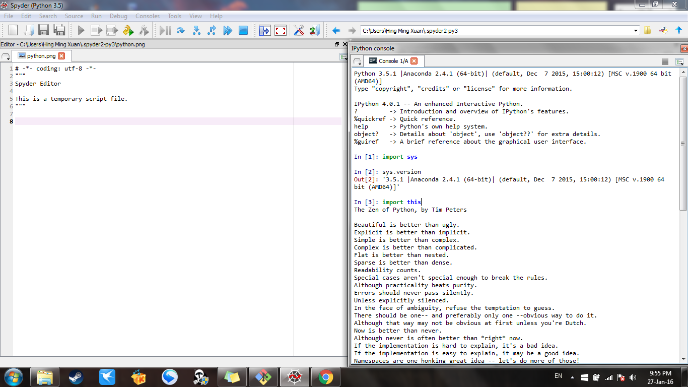

UECM3033 Assignment #1 Report
========================================================

- Prepared by: ** Hing Ming Xuan**
- Tutorial Group: T2

--------------------------------------------------------

## Task 1 -- setup a github repository

The reports, codes and supporting documents are uploaded to Github at: 

<<<<<<< HEAD
[https://github.com/HingMingXuan/UECM3033_assign1](https://github.com/HingMingXuan/UECM3033_assign1)
=======
[https://github.com/HingMingXuan/UECM3033_assign1](https://github.com/HingMingXuan/UECM3033_assign1.git)
>>>>>>> 4327bf8c7fd781d02173958fc0d3e9b0a5ec31a2

---------------------------------------------------------

## Task 2 -- setup python

Put here the screen shot of file (python.png)

------------------------------------------------------------

## Task 3 -- modify and run Python script

In this section, please report:

1. The hexadecimal value of your student ID.
2. Write down the definite integrals that you have chosen.
3. Write down your system of 10 linear equations.

Solution:
1. Hexadecimal representation of 1205182 is 0x1263be.
<<<<<<< HEAD

2. $$\int_0^{\infty} e^{-x}*{sin{x}/x} dx = \frac{{\pi}}{4}.$$

=======
2. 
$$\int_0^{\infty} e^{-x}*{sin{x}/x} dx = \frac{{\pi}}{4}.$$
>>>>>>> 4327bf8c7fd781d02173958fc0d3e9b0a5ec31a2
3.

\begin{align*}
3 x_0 +x_1 +2 x_2 +3 x_3 + x_4 + 2 x_5 +5 x_6 +x_7 +x_8 +2 x_9 &= 2,\\
<<<<<<< HEAD

3 x_0 + 2 x_1 +2 x_2 +x_3 +4 x_4 +x_5 +x_6 +x_7 +2 x_8 +x_9 &= 6,\\

x_0 +2 x_1 +3 x_2 +4 x_3 +3 x_4 + 2 x_5 +x_6 +2 x_7 +3 x_8 +4 x_9 &= 5,\\

2 x_0 +2 x_1 +3 x_2 +x_3 +4 x_4 + 5 x_5 +3 x_6 +x_7 +x_8 +2 x_9 &= 1,\\

2 x_0 +3 x_1 +4 x_2 +x_3 +2 x_4 + 3 x_5 +2 x_6 +4 x_7 +5 x_8 +3 x_9 &= 3,\\

x_0 +4 x_1 +3 x_2 +2 x_3 +3 x_4 +x_5 +2 x_6 +x_7 +3 x_8 +2 x_9 &= 3,\\

x_0 +3 x_1 +2 x_2 +x_3 +2 x_4 + 5 x_5 +4 x_6 +3 x_7 +2 x_8 +x_9 &= 4,\\

3 x_0 +x_1 +2 x_2 +4 x_3 +x_4 +5 x_5 +3 x_6 +2 x_7 +2 x_8 +2 x_9 &= 9,\\

2 x_0 +x_1 +x_2 +x_3 +4 x_4 + 3 x_5 +x_6 +3 x_7 +2 x_8 +4 x_9 &= 8,\\

x_0 +x_1 +x_2 +4 x_3 +2 x_4 + 2 x_5 +3 x_6 +4 x_7 +x_8 +3 x_9 &= 2.

=======
3 x_0 + 2 x_1 +2 x_2 +x_3 +4 x_4 +x_5 +x_6 +x_7 +2 x_8 +x_9 &= 6,\\
x_0 +2 x_1 +3 x_2 +4 x_3 +3 x_4 + 2 x_5 +x_6 +2 x_7 +3 x_8 +4 x_9 &= 5,\\
2 x_0 +2 x_1 +3 x_2 +x_3 +4 x_4 + 5 x_5 +3 x_6 +x_7 +x_8 +2 x_9 &= 1,\\
2 x_0 +3 x_1 +4 x_2 +x_3 +2 x_4 + 3 x_5 +2 x_6 +4 x_7 +5 x_8 +3 x_9 &= 3,\\
x_0 +4 x_1 +3 x_2 +2 x_3 +3 x_4 +x_5 +2 x_6 +x_7 +3 x_8 +2 x_9 &= 3,\\
x_0 +3 x_1 +2 x_2 +x_3 +2 x_4 + 5 x_5 +4 x_6 +3 x_7 +2 x_8 +x_9 &= 4,\\
3 x_0 +x_1 +2 x_2 +4 x_3 +x_4 +5 x_5 +3 x_6 +2 x_7 +2 x_8 +2 x_9 &= 9,\\
2 x_0 +x_1 +x_2 +x_3 +4 x_4 + 3 x_5 +x_6 +3 x_7 +2 x_8 +4 x_9 &= 8,\\
x_0 +x_1 +x_2 +4 x_3 +2 x_4 + 2 x_5 +3 x_6 +4 x_7 +x_8 +3 x_9 &= 2.
>>>>>>> 4327bf8c7fd781d02173958fc0d3e9b0a5ec31a2
\end{align*}

-----------------------------------

<<<<<<< HEAD

=======
>>>>>>> 4327bf8c7fd781d02173958fc0d3e9b0a5ec31a2
last modified: 28/Jan/2016
